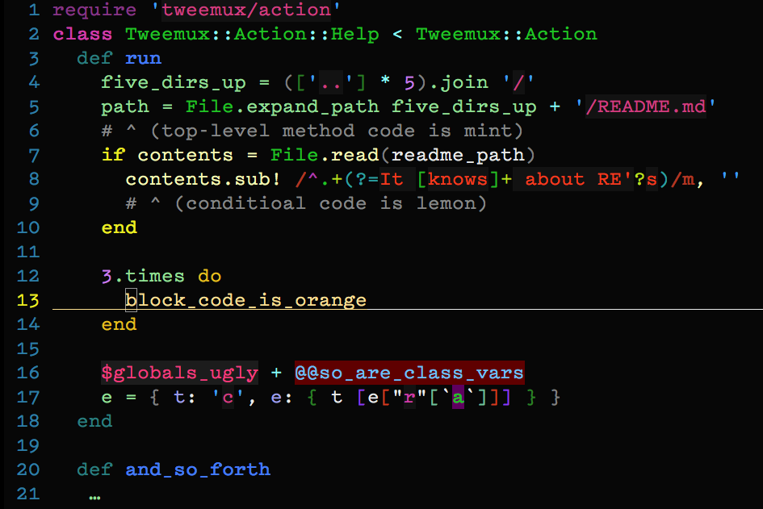

# vim-detailed

So many 256-color schemes merely shift the palette around, displaying only 8
colors (even though they're a *different* set of 8 colors than default).

This scheme is more detailed than that.

Your eyes will learn to pick up on subtler patterns without requiring as
much from your conscious mind.  Instead of the goal being merely looking
cool, the goal is to maximize info bandwidth from the computer to the brain.
The regexes, for example, are much easier to pick out. The overall feel of a
given file becomes much more intuitively recognizeable (you'll know you're
in foo.rb, not bar.rb, without having to read any text). Certain bits will
"pop" into being the right colors, such as the difference between
"RUBY_VERISON" and "RUBY_VERSION", or # encoding: utf-8

## 256 Color Requirement

If you aren't getting 256 colors, you aren't getting detailed.vim.
Typically, you'll have to make sure your `$TERM` variable is set right. This
can get un-set by some programs, such as tmux. So you can force it to
something like:

    export TERM=screen-256color
    # or:
    export TERM=xterm-256color

If these are unavailable on the target system, you might have to place a
terminfo file in `~/.terminfo/`  -or- you can be totally gross and force it
with `:set &t_Co=256` in vim. But don't be gross. It's uncouth.

## Download

 If using Pathogen,

     cd ~/.vim/bundle && git clone https://github.com/rking/vim-detailed

 If using no vim plugin manager:

     mkdir -p ~/.vim/colors/ && cd $_ && wget https://raw.github.com/rking/vim-detailed/master/colors/detailed.vim

## Setup

In your ~/.vimrc (or ~/.vim/plugin/colorscheme.vim if you like to organize):

    colo detailed

This enables it globally. If you want to just do it for a trial, as long as
you have done one of the steps in the "Download" section, above, you can do:

    vim foo.rb +colo\ detailed

Or, from within vim:

    :colo detailed

## Language Support So Far

- Ruby: 113 details detailed.
- C: 12 details detailed.
- Go: 10 details detailed.
- Diff: 10 details detailed.
- Vim: 4 details detailed.

Note that for fully supported languages (Ruby), you get the whole experience of having the subtle color shades that fingerprint and lint the code when you glance at it.

For the lesser grades mentioned above, you should get a bit more, but know that the `syntax/[yourlang].vim` has to have enough semantic parsing to make this possible. If you want to go further, you can certainly get a patch in that enhances the syntax parsing inside vim-detailed's `colors/detailed.vim` file.

For all other languages, even the ones not listed above, you should at least get:
- Rainbow parens/brackets/curlies (which can be very helpful when the syntax gets deep)
- Quiet comments (grey, because "a comment is a lie waiting to happen")
- Strings with gray background (so it looks like a solid chunk)
- Muted colorcolumn (gray instead of GIANT LOUD RED)
- A color palette somewhat consistent with the detailed ones

## Troubleshooting

This is wrong:

